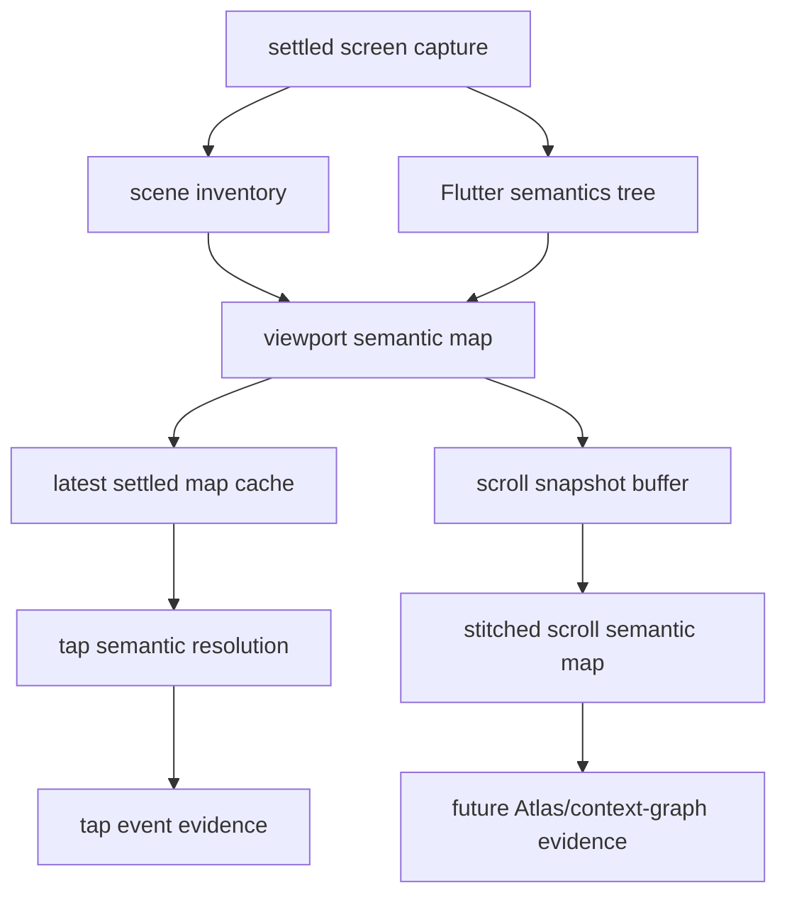
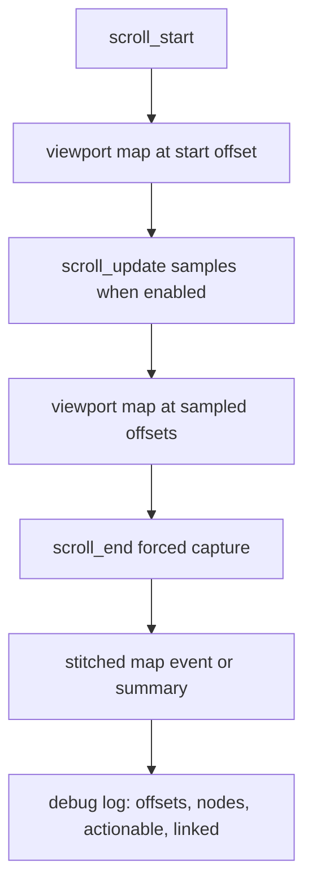

## Goal Capsule

| Field | Value |
|---|---|
| Objective | Turn the current viewport semantic-map POC into a reliable evidence layer for tap interpretation, scrollable-screen context, anomaly signals, and eventual production capture. |
| Authority | Existing SDK privacy and fingerprint boundaries win over convenience; semantic/accessibility evidence supports matching but does not become durable identity. |
| Execution profile | Implement incrementally in the SDK first, then validate with focused widget tests and a live Blend app run. |
| Stop conditions | Stop and ask before making semantic-map hashes part of state signatures, before changing production collector defaults, or before deleting the local Blend app `.env`. |
| Tail ownership | SDK changes land in `packages/tugboat`; Blend app changes are only a local test harness unless explicitly promoted. |

---

## Product Contract

### Summary

The existing SDK POC proves that a visible viewport semantic map can enrich tap events on the Blend subscription paywall, including a custom CTA that normal Flutter semantics alone missed.
The next step is to make the map useful for the original product use case: avoid missed actions on scrollable screens, reduce state-fracture pressure by treating semantics as evidence rather than identity, and define a production-safe capture path that can be tested without depending on environment configuration.

### Problem Frame

Screenshots alone only describe the visible area and can miss controls below the fold.
Flutter semantics alone can be sparse or noisy, especially with custom widgets and disabled/offscreen artifacts.
Scene inventory alone has fingerprints and bounds but lacks the accessibility tree's role/action/map-like context.
The SDK needs a combined evidence layer that lets downstream graph and Atlas matching ask: what was visible, what was actionable, what scroll context did it belong to, and did the user tap something expected?

### Requirements

- R1. The SDK emits viewport semantic maps that combine Flutter semantics with scene inventory fallback for visible controls.
- R2. The SDK can build a scroll-aware semantic snapshot from multiple viewport maps without requiring a full-length screenshot.
- R3. Semantic maps remain matching evidence and never directly replace state signatures, target fingerprints, or Atlas identity.
- R4. Tap events include semantic-map resolution when enabled, including actionable, disabled, non-actionable, and outside-known-ui outcomes.
- R5. Anomaly logs/events distinguish useful user behavior signals from SDK noise, including taps outside known actionable UI.
- R6. Production capture support is specified as a guarded future-capable path: productionLean remains off by default, and any opt-in path must be redacted, payload-bounded, and separately validated before use.
- R7. Debug logging is rich enough to verify live behavior from the Flutter debug console and Blend app logs.
- R8. The implementation is covered by focused SDK tests and a live Blend app smoke run that captures SDK logs.

### Acceptance Examples

- AE1. Given a visible custom CTA that is excluded from Flutter semantics, when the SDK emits a map, then the CTA appears as an inventory-sourced actionable node and a tap resolves to `matched_actionable`.
- AE2. Given a long scrollable list, when the user scrolls through multiple positions, then semantic snapshots can be associated with scroll offsets and stitched into a scroll-context view without merging them into state identity.
- AE3. Given a tap on static text or background, when semantic-map resolution runs, then the tap is classified as non-actionable or outside known UI and emits a debug/anomaly signal.
- AE4. Given productionLean capture with the semantic feature disabled, when normal replay capture runs, then no semantic map payload is emitted.
- AE5. Given a future production opt-in path is deliberately enabled for validation, when a map is emitted, then text-like payload is redacted or excluded and bounded by node count and byte size.

### Scope Boundaries

- In scope: SDK data models, map building, scroll-aware aggregation, anomaly/tap resolution, production-safe gating, debug logs, unit/widget tests, and one live Blend app verification pass.
- Out of scope: making accessibility node IDs durable identifiers, deriving Atlas nodes from production sessions, uploading full text labels from accessibility nodes, or changing PMKit CLI graph merge semantics in this plan.
- Deferred to follow-up work: downstream context-graph ingestion and Atlas confidence scoring that consume these semantic-map events.

---

## Planning Contract

### Key Technical Decisions

- KTD1. Treat semantic maps as evidence, not identity.
  The map can improve matching confidence and explain taps, but state signatures and target fingerprints stay build-scoped structural anchors.
- KTD2. Keep the settled viewport map as the source of truth for tap resolution.
  Tap-local inventory may help target anchoring, but it must not replace the latest settled semantic map or create duplicate map events.
- KTD3. Model scroll coverage as stitched viewport observations.
  Flutter only exposes what is built and visible for lazy scrollables, so the SDK should capture multiple viewport maps at scroll offsets instead of pretending it can read the whole virtual list in one pass.
- KTD4. Separate exploration defaults from production capture.
  Exploration can emit rich maps and logs; production support must add explicit gating, redaction, byte caps, and sampling before it is considered on.
- KTD5. Prefer confidence and provenance over hard joins.
  Each semantic node should retain `source`, linked inventory fingerprint when available, bounds, role/actions, scroll context, and filtered/noise status so downstream consumers can decide whether to trust it.

### High-Level Technical Design

### Assumptions

- The existing `viewport_semantic_map` POC remains the base rather than being rewritten.
- The first scroll-stitch implementation can be SDK-local evidence; downstream CLI ingestion can follow after the payload is stable.
- Local Blend app config and path dependency changes are test harness work only, not merge-ready product changes.
- Production capture support in this plan means guardrail and contract implementation first; productionLean must continue to emit nothing by default, and any opt-in path must be deliberately enabled in SDK code or test harness configuration without environment-provider dependencies.

### System-Wide Impact

This affects replay payload shape, debug logs, event cardinality, and future context-graph evidence.
It should not affect screenshot capture behavior, privacy masking defaults, or existing state signature generation unless a later plan explicitly opts into downstream consumption.

### Risks & Dependencies

| Risk | Mitigation |
|---|---|
| Semantic nodes create state-fracture if used as identity. | Keep map hash out of `TugboatStateAnchor` and document evidence-only semantics in tests and payload names. |
| Scroll stitching overclaims full-screen coverage for lazy lists. | Store observed offsets and coverage, not a claim that every list item exists. |
| Production payload leaks labels or hints. | Redact or omit text payloads in production mode; preserve role/action/bounds/fingerprint/provenance only. |
| Logs become too noisy to debug. | Add node filtering and summary logs before detailed node dumps. |
| Blend harness changes get confused with SDK merge scope. | Keep mobile_app verification changes separate and call out their local-only status in final handoff. |

---

## Implementation Units

### U1. Normalize and Filter Viewport Semantic Nodes

- **Goal:** Make the current viewport map less noisy and safer to hash/log by filtering tiny edge artifacts and clamping bounds.
- **Requirements:** R1, R3, R7, AE1.
- **Dependencies:** None.
- **Files:**
  - `packages/tugboat/lib/src/anchor_models.dart`
  - `packages/tugboat/lib/src/anchor_resolver.dart`
  - `packages/tugboat/test/viewport_semantic_map_test.dart`
- **Approach:** Add a normalization pass after semantics/inventory merge that clamps bounds to the visible viewport for emitted/logged nodes, drops zero-use tiny edge artifacts unless linked to actionable inventory, and records filtered counts in the map summary.
- **Patterns to follow:** Existing `TugboatNormalizedBounds`, `_boundsIntersectsViewport`, and summary-map fields in `anchor_resolver.dart`.
- **Test scenarios:**
  - A semantic node with tiny negative top/left bounds and no fingerprint is filtered and increments a filtered summary count.
  - A tiny but linked actionable inventory node is retained when it overlaps a real tap target.
  - Existing Blend-style CTA fallback still emits one inventory actionable node and resolves to `matched_actionable`.
- **Verification:** Existing viewport map tests still pass, and the live debug log no longer lists unlinked tiny top-edge nodes as normal map entries.

### U2. Add Scroll-Offset Context to Viewport Semantic Maps

- **Goal:** Attach scroll context to maps emitted during scroll lifecycle events so multiple viewport observations can be stitched.
- **Requirements:** R2, R7, AE2.
- **Dependencies:** U1.
- **Files:**
  - `packages/tugboat/lib/src/anchor_models.dart`
  - `packages/tugboat/lib/src/controller.dart`
  - `packages/tugboat/test/scroll_attribution_test.dart`
  - `packages/tugboat/test/viewport_semantic_map_test.dart`
- **Approach:** Extend the viewport semantic map payload with optional scroll metadata: scrollable fingerprint, axis, offset, normalized offset, viewport index/source trigger, and observed coverage range.
  Populate this from `_ScrollTracker` during `scroll_start`, sampled `scroll_update`, and `scroll_end` captures.
- **Execution note:** Characterize current scroll event behavior first so the map additions do not break existing scroll attribution.
- **Patterns to follow:** Existing `TugboatScrollSample`, `_scrollEventData`, and `recordScrollStart` / `recordScrollUpdate` / `recordScrollEnd` flow in `controller.dart`.
- **Test scenarios:**
  - A scroll start emits a map with offset `0` and the scrollable fingerprint when available.
  - A scroll update with `captureScrollSamples` enabled can emit or update a map tied to the current offset.
  - A scroll end map carries the final offset and links to the same scrollable fingerprint as the scroll event.
  - Existing scroll attribution tests continue to pass without semantic-map config enabled.
- **Verification:** Widget tests prove map payloads include scroll context only when the feature is enabled.

### U3. Build a Stitched Scroll Semantic Snapshot

- **Goal:** Produce an SDK-side summary of observed scrollable content across multiple viewport maps without implying full virtual-list knowledge.
- **Requirements:** R2, R3, R8, AE2.
- **Dependencies:** U2.
- **Files:**
  - `packages/tugboat/lib/src/anchor_models.dart`
  - `packages/tugboat/lib/src/controller.dart`
  - `packages/tugboat/test/viewport_semantic_map_test.dart`
  - `packages/tugboat/test/scroll_attribution_test.dart`
- **Approach:** Add a per-session or per-scroll buffer keyed by state signature plus scrollable fingerprint.
  Store distinct observed map slices by offset band and emit a `scroll_semantic_snapshot` event or summary only when at least two offsets are observed for the same scrollable context.
  Deduplicate nodes by linked fingerprint first, then role/actions/bounds/offset band when no fingerprint exists.
- **Technical design:** Directional model:
  - observation key: route key + state signature + scrollable fingerprint
  - slice key: normalized offset band + map hash
  - node key: linked fingerprint when present, otherwise source + role + actions + rounded bounds + offset band
- **Test scenarios:**
  - Two maps at different offsets for one scrollable produce one stitched summary with two observed ranges.
  - Repeated maps at the same offset dedupe without increasing coverage.
  - Nodes without fingerprints do not collapse across distant offset bands.
  - The stitched summary is absent for non-scroll screens with only one viewport map.
- **Verification:** Tests demonstrate observed coverage and dedupe behavior without changing state signatures.

### U4. Preserve Evidence-Only Semantics in Event Payloads

- **Goal:** Make the payload contract explicit so semantic maps support downstream matching without becoming identity.
- **Requirements:** R3, R4, R5, AE3.
- **Dependencies:** U1, U2, U3.
- **Files:**
  - `packages/tugboat/lib/src/anchor_models.dart`
  - `packages/tugboat/lib/src/controller.dart`
  - `packages/tugboat/test/viewport_semantic_map_test.dart`
  - `packages/tugboat/test/tugboat_replay_test.dart`
- **Approach:** Keep `viewportSemanticResolution` inside tap event data, keep `viewport_semantic_map` and any stitched snapshot as evidence events, and add tests that map hashes do not feed `TugboatStateAnchor.signature`.
  Add explicit provenance fields such as `source`, `linkedFingerprint`, `scrollContext`, and `confidenceHints` where useful.
- **Test scenarios:**
  - A map hash change alone does not change the state anchor signature.
  - A tap on actionable UI includes semantic resolution and the existing target anchor remains present.
  - A tap on non-actionable UI emits `matched_non_actionable` and does not fabricate a target fingerprint.
  - A tap outside known UI emits `outside_known_ui` and preserves existing `tap_outside_tree` behavior.
- **Verification:** Replay tests prove existing event shape remains backward-compatible except for additive evidence data.

### U5. Add Production-Safe Capture Gate and Payload Bounds

- **Goal:** Define a safe production path without turning it on by default.
- **Requirements:** R6, R8, AE4, AE5.
- **Dependencies:** U1, U4.
- **Files:**
  - `packages/tugboat/lib/src/controller.dart`
  - `packages/tugboat/lib/src/anchor_models.dart`
  - `packages/tugboat/test/viewport_semantic_map_test.dart`
  - `packages/tugboat/test/tugboat_replay_test.dart`
- **Approach:** Introduce SDK-level capture policy that keeps exploration rich and keeps productionLean off by default.
  Implement the guardrails for a future opt-in path, including node-count caps, byte-size caps, text redaction, and optional anomaly-only emission, but do not silently enable production emission as part of the POC.
  Do not depend on environment variables or app config providers for this work.
- **Execution note:** Keep this conservative; passing tests should prove that productionLean emits nothing by default and that any opt-in behavior is deliberate, bounded, and test-only unless the user explicitly promotes it.
- **Test scenarios:**
  - Default productionLean capture emits no semantic map and no semantic tap resolution.
  - A deliberate production opt-in test path emits bounded/redacted evidence only.
  - A payload that exceeds node or byte caps is summarized or dropped with a debug skip reason.
  - Exploration mode behavior remains unchanged by production policy defaults.
- **Verification:** Tests prove safe defaults and bounded opt-in behavior.

### U6. Improve Debug Logs for Live Verification

- **Goal:** Make SDK logs sufficient to verify map emission, scroll stitching, production skips, and tap/anomaly outcomes from the Flutter debug console.
- **Requirements:** R5, R7, R8, AE1, AE2, AE3.
- **Dependencies:** U1, U2, U3, U5.
- **Files:**
  - `packages/tugboat/lib/src/controller.dart`
  - `packages/tugboat/test/viewport_semantic_map_test.dart`
- **Approach:** Keep the existing summary log shape, add filtered count, scroll context, production skip reason, stitch coverage, and anomaly reason.
  Limit detailed node logs to a capped sample and make the summary line enough for live checks.
- **Test scenarios:**
  - Debug-enabled exploration logs include route, state, node counts, source counts, linked count, filtered count, and hash.
  - Tap logs include status, role, actions, bounds, fingerprint, and anomaly reason when applicable.
  - Production-disabled logs show a skip reason without emitting payload events.
- **Verification:** Live Blend run logs contain one settled map summary, a CTA `matched_actionable` tap, and any scroll snapshot summaries from the tested flow.

### U7. Live Blend App Smoke Verification

- **Goal:** Validate the SDK behavior against the real Blend mobile app and preserve logs for review.
- **Requirements:** R8, AE1, AE2, AE3, AE4.
- **Dependencies:** U1, U2, U3, U4, U5, U6.
- **Files:**
  - `pubspec.yaml` in target repo `mobile_app`
  - `lib/services/tugboat_replay_config.dart` in target repo `mobile_app`
  - SDK log artifact path recorded in final handoff
- **Approach:** Use the local path dependency to the SDK and hardcoded test config already established for Blend testing.
  Run the app on an emulator, navigate to the subscription paywall, interact with at least one actionable CTA, one non-actionable/background area, and one scrollable surface if available.
  Capture Flutter SDK logs and verify `.env` remains byte-identical to its expected local copy.
- **Execution note:** This is a runtime smoke gate, not merge-scope app work.
- **Test scenarios:**
  - Paywall map emits with both semantic and inventory sources.
  - CTA tap resolves `matched_actionable` with linked fingerprint.
  - Non-actionable/background tap logs anomaly status without breaking tap recording.
  - Scrollable screen emits multiple offset-aware maps or a stitched snapshot when the tested flow exposes scroll.
  - Production-disabled mode can be smoke checked locally without relying on environment variables.
- **Verification:** Final handoff cites exact log file paths and key log lines for map emission, tap resolution, scroll snapshot if observed, and `.env` integrity.

---

## Verification Contract

| Gate | Scope | Expected Outcome |
|---|---|---|
| Focused SDK tests | `packages/tugboat/test/viewport_semantic_map_test.dart`, `packages/tugboat/test/scroll_attribution_test.dart`, relevant replay tests | Semantic map, tap resolution, scroll context, evidence-only, and production gate scenarios pass. |
| SDK static analysis | `packages/tugboat/lib/src/controller.dart`, `packages/tugboat/lib/src/anchor_resolver.dart`, `packages/tugboat/lib/src/anchor_models.dart`, related tests | Analyzer reports no new issues. |
| Full SDK regression | `packages/tugboat` test suite | Existing replay, scroll, and payload behavior remains green. |
| Live Blend smoke | `mobile_app` running on Android emulator | Debug console shows semantic map summaries, CTA tap resolution, and scroll/anomaly evidence where exercised. |
| Local safety check | `mobile_app` local files | `.env` remains present and unchanged from the expected local baseline; test harness changes are identified separately from SDK changes. |

---

## Definition of Done

- U1-U6 are implemented in `packages/tugboat` with focused tests.
- Existing scene inventory, tap, scroll, route, and frame capture behavior remains compatible.
- Semantic maps and stitched scroll snapshots are additive evidence events and do not alter state signatures.
- ProductionLean remains off by default for semantic-map payloads, with bounded/redacted opt-in behavior covered by tests.
- Debug logs are sufficient to verify map emission and tap resolution from a live Flutter console.
- The Blend app smoke run produces retained logs with at least one `viewport_semantic_map` summary and one `viewport_semantic_tap` resolution.
- Temporary or abandoned implementation experiments are removed before handoff.

---

## Appendix

### Research Notes

- The current POC already emits `viewport_semantic_map` and `viewportSemanticResolution` in exploration mode.
- Live Blend evidence from the previous run showed `/subscriptionPaywall` with `nodes=23`, `actionable=17`, `linked=10`, `semantic=15`, `inventory=8`, and the CTA tap resolving to `matched_actionable`.
- The current audit found four gaps this plan addresses: visible-viewport-only coverage, productionLean disabled behavior, evidence-versus-identity boundaries, and noisy tiny semantic nodes near viewport edges.
