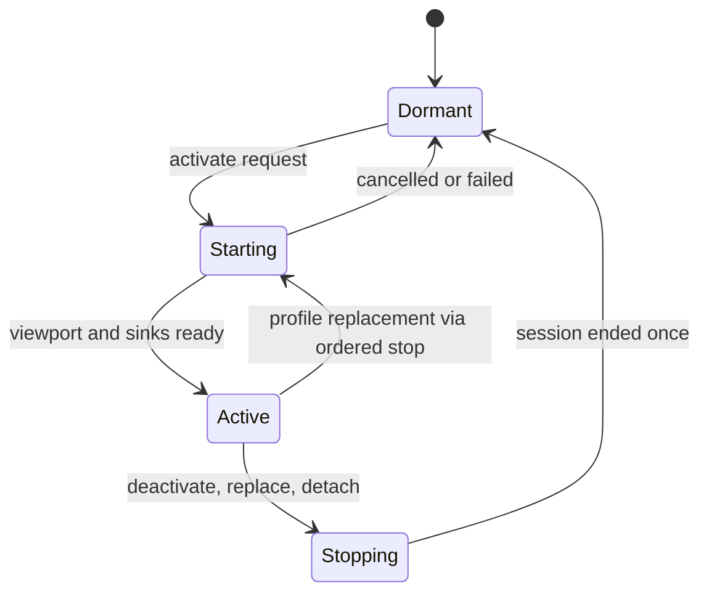
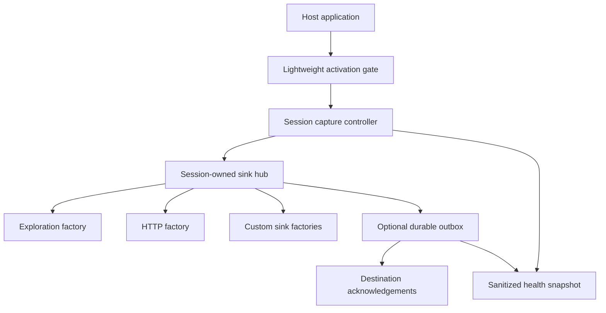
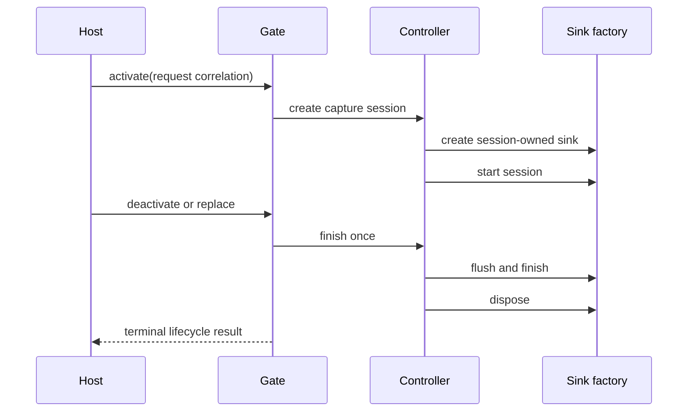

# SDK Lifecycle and Durable Capture - Plan

## Goal Capsule

Make the Tugboat Flutter SDK safe to activate at runtime, explicit about request and capture-session identity, extensible through lifecycle-owned sinks, and resilient to transient delivery failure without losing its dormant zero-capture posture.
Measure and bound screenshot cost, expose privacy and transport health, and validate fingerprint behavior on representative release builds before widening production capture.

The SDK owns capture lifecycle, session evidence, masking, sink fan-out, and delivery health.
The host app owns when capture is requested and which approved destination factories are configured.
Build identity remains the boundary for structural fingerprints; cross-build Atlas correlation remains outside this repository.

Stop implementation if dormant mode begins installing capture machinery, activation can mix two capture sessions, the outbox can expose unmasked content, or release-build validation shows fingerprint instability that cannot be classified.

---

## Product Contract

### Summary

Replace rebuild-dependent runtime activation with a lightweight always-mounted gate that remains capture-inert while dormant and mounts the current capture wrapper only while active.
Define activation request identity separately from the emitted capture session, publish a factory-owned custom sink contract, add an opt-in append-only durable outbox, and make screenshot cost, masking decisions, queue pressure, retries, and drops observable.

### Problem Frame

`TugboatReplayConfig.profile` defaults to `dormant`, and `wrapApp` currently returns the host child unchanged.
Calling `activate()` changes static state but cannot notify a widget that was never mounted, so the host must rebuild before capture starts.
The supplied activation `sessionId` is retained as an active request identifier while the controller generates a different emitted session ID, leaving correlation semantics ambiguous.

The SDK fans evidence to internal WebSocket and HTTP sinks through bounded in-memory queues.
There is no supported custom-sink lifecycle or durable retry path, so process death loses pending output and applications cannot add a destination without importing internals.
Screenshot readback and PNG encoding also perform UI-thread work without a stable performance contract or health surface.

### Actors

- A1. Host application: wraps the app, installs the navigator observer, configures approved sinks and masking, and requests activation or deactivation.
- A2. Capture gate: observes lifecycle state and mounts or disposes capture machinery without changing the host child identity while dormant.
- A3. Capture controller: owns one emitted session, evidence buffers, screenshots, anchors, events, and sink fan-out.
- A4. Capture sink factory: creates one sink instance per emitted session and owns start, flush, finish, and disposal behavior.
- A5. SDK integrator: validates privacy, performance, identity stability, and transport health before production rollout.

### Requirements

#### Lifecycle and identity

- R1. `wrapApp` must always install a lightweight activation gate, but dormant and disabled states must install no pointer, semantics, screenshot, navigation, or sink capture machinery.
- R2. `activate()` and `deactivate()` must notify the mounted gate without requiring an unrelated host rebuild, and repeated identical requests must be idempotent.
- R3. Every activation request must have a request correlation ID distinct from the controller-generated capture session ID, and every event, frame, sink lifecycle call, and diagnostic must expose the correct identity where applicable.
- R4. Rapid activate, deactivate, profile replacement, app pause, detach, and wrapper disposal must end each created session exactly once and must never let evidence cross session boundaries.

#### Sink and delivery boundary

- R5. The public API must accept sink factories rather than live sink instances so the SDK owns one isolated sink lifecycle per capture session.
- R6. Built-in WebSocket and HTTP destinations must be expressed through the same lifecycle contract without breaking existing configuration fields during the compatibility period.
- R7. An opt-in append-only outbox must persist sanitized, versioned delivery envelopes, recover incomplete work after restart, enforce byte and age bounds, and remove entries only after destination acknowledgement or explicit expiry.
- R8. Retry, backoff, acknowledgement, partial batch failure, shutdown flush, corruption, quota exhaustion, and permanent rejection must have deterministic outcomes and bounded resource use.

#### Performance, privacy, and health

- R9. Screenshot capture must record queue wait, readback, mask collection, encoding, encoded size, deduplication, coalescing, and drop reasons without recording protected content in diagnostics.
- R10. Capture policy must be able to reduce or skip screenshot work under sustained budget pressure while preserving interaction and structural evidence and reporting the degradation.
- R11. The SDK must expose a bounded health snapshot covering active profile, request and session identity, sink/outbox pressure, retry state, screenshot budget state, truncation, and recent sanitized failures.
- R12. Durable envelopes, custom sinks, semantic maps, and diagnostics must honor the same masking and data-minimization boundary as built-in transports; no new arbitrary rendered text or credentials may enter telemetry.

#### Validation and ownership

- R13. Tests and fixtures must validate nested navigators, anonymous routes, overlays, platform views, generated widget-name maps, obfuscated release builds, activation races, and process-restart delivery recovery.
- R14. Cross-build or cross-schema target correlation must remain an Atlas/Enhancement API concern; the SDK emits exact build and fingerprint-schema provenance but does not declare two fingerprints equivalent.

### Key Flows

- F1. Runtime activation
  - **Trigger:** A1 calls `activate()` while the app is mounted in dormant mode.
  - **Steps:** The gate observes the request, creates one controller with a new capture-session ID, creates session-owned sinks, and begins capture after viewport readiness.
  - **Outcome:** Capture starts without a host rebuild and request/session identities remain traceable.
  - **Covered by:** R1-R4
- F2. Durable delivery recovery
  - **Trigger:** A destination is unavailable or the process terminates with acknowledged work outstanding.
  - **Steps:** Sanitized envelopes are appended before delivery, replayed within bounds after restart, acknowledged idempotently, and expired or quarantined with health evidence when unrecoverable.
  - **Outcome:** Delivery is bounded and recoverable without duplicating capture sessions or leaking protected content.
  - **Covered by:** R5-R8, R12
- F3. Screenshot budget degradation
  - **Trigger:** Readback or encoding exceeds the configured rolling budget.
  - **Steps:** The controller coalesces or skips eligible screenshots, continues structural capture, and records sanitized budget and drop diagnostics.
  - **Outcome:** Host responsiveness is protected and downstream consumers can distinguish missing screenshots from missing interactions.
  - **Covered by:** R9-R11

### Acceptance Examples

- AE1. Given an app mounted with the default dormant profile, when `activate()` is called, capture begins without rebuilding `MaterialApp`, and exactly one emitted session is linked to the activation request.
- AE2. Given activate-deactivate-activate calls in rapid succession, each created session ends once, no event is delivered to the prior session's sinks, and the second activation has a new capture-session ID.
- AE3. Given a process restart with unacknowledged outbox entries, delivery resumes within retry bounds and acknowledged envelopes are not delivered again.
- AE4. Given screenshot encoding exceeds budget, interaction events continue, screenshots are coalesced or skipped, and health reports the specific degradation without including pixels or labels.
- AE5. Given the same tagged actionable control in two locale variants of one exact release build, structural identity remains stable; a different build is not automatically treated as equivalent.

### Scope Boundaries

In scope: lifecycle notification, identity semantics, sink factories, durable delivery, performance instrumentation and policy, privacy/health diagnostics, and release-build validation.

Deferred to follow-up work: native platform-view capture adapters, video texture capture, iOS-specific background upload services, and server-side delivery deduplication beyond the SDK contract.

Outside this repository: Collector storage policy, Context Graph revisioning, Atlas cross-build matching, and production rollout authorization.

---

## Planning Contract

### Key Technical Decisions

- KTD1. Use an always-mounted lightweight activation gate; do not preserve literal dormant pass-through because it cannot observe runtime activation.
- KTD2. Dormant means capture-inert rather than widget-absent: the gate may listen to SDK lifecycle state but must not install capture machinery or sinks.
- KTD3. Preserve both identities: host-supplied activation/request ID for orchestration correlation and SDK-generated capture-session ID for emitted evidence.
- KTD4. Publish sink factories, not singleton sink objects, so session lifecycle, isolation, finish ordering, and disposal remain SDK-owned.
- KTD5. Implement durability as an opt-in append-only outbox below sink fan-out, with versioned sanitized envelopes and destination acknowledgements.
- KTD6. Keep built-in configuration source-compatible during migration by adapting current HTTP and exploration fields into built-in factories.
- KTD7. Protect the host frame budget with measurement first, then rolling-budget coalescing and degradation; do not move widget-tree access off the UI thread where Flutter forbids it.
- KTD8. Expose diagnostics as bounded structured health, never as raw payload echoes, screenshots, arbitrary labels, or exception dumps containing requests.
- KTD9. Treat release-build validation failures as compatibility evidence, not permission to weaken build-scoped fingerprint identity.
- KTD10. Keep cross-build equivalence outside the SDK; emit provenance sufficient for the Enhancement API to reason about compatibility.

### High-Level Technical Design

### Sequencing

Lifecycle and identity land first because every sink and diagnostic depends on an unambiguous session boundary.
The sink factory contract then provides the seam for the durable outbox.
Performance and health instrumentation should land before degradation policy so thresholds are evidence-based.
Release-build validation and documentation close the rollout after the behavior is stable.

### Assumptions

- A lightweight `Listenable`-style lifecycle notification can remain inert enough for dormant production use; implementation must measure this rather than assuming zero cost.
- Server destinations can support or emulate idempotent acknowledgement keys for replayed outbox envelopes.
- Exact performance thresholds will be set from benchmark evidence during implementation and recorded in the verification fixture.

---

## Implementation Units

### U1. Reactive activation gate and lifecycle state machine

- **Goal:** Start and stop capture from SDK lifecycle requests without host rebuilds or duplicate sessions.
- **Requirements:** R1-R4; KTD1-KTD3.
- **Dependencies:** None.
- **Files:** Modify `packages/tugboat/lib/src/tugboat.dart` and `packages/tugboat/lib/src/controller.dart`; test `packages/tugboat/test/tugboat_replay_test.dart`.
- **Approach:** Introduce one mounted gate per wrapper, model explicit lifecycle states, serialize replacements through stop-before-start, and keep dormant capture machinery absent.
- **Execution note:** Begin with lifecycle characterization tests, then add failing activation-without-rebuild and race tests.
- **Patterns to follow:** Existing controller disposal, viewport-ready startup, and global disabled behavior.
- **Test scenarios:** Dormant mount performs no capture; activation starts without rebuild; identical activation is idempotent; replacement ends the old session before creating the new one; activate/deactivate races do not leak controllers; detach and wrapper disposal end once.
- **Verification:** Lifecycle tests prove one active controller, one terminal event per session, and no dormant capture side effects.

### U2. Request and capture-session identity contract

- **Goal:** Make correlation and emitted-session identity explicit across models, events, frames, and sinks.
- **Requirements:** R3-R4; KTD3.
- **Dependencies:** U1.
- **Files:** Modify public replay/session models in `packages/tugboat/lib/src/models.dart` and the collector mapping in `packages/tugboat/lib/src/collector_mapper.dart`; test `packages/tugboat/test/tugboat_replay_test.dart`, `packages/tugboat/test/collector_mapper_test.dart`, and the JSON fixtures in `packages/tugboat/test/helpers/json_roundtrip.dart`.
- **Approach:** Preserve the activation identifier as request provenance and generate one immutable capture-session identifier per controller.
- **Test scenarios:** Request identity survives activation; capture ID differs when a new session starts; every event and frame carries the correct capture session; sinks receive both identities where contractually required; legacy JSON remains readable.
- **Verification:** Schema fixtures and lifecycle tests cannot confuse request, local capture, or collector-issued session identifiers.

### U3. Public session-owned sink factory API

- **Goal:** Allow approved custom destinations without exposing internal sink ownership.
- **Requirements:** R5-R6, R12; KTD4, KTD6, KTD8.
- **Dependencies:** U1, U2.
- **Files:** Modify `packages/tugboat/lib/tugboat.dart`, replay config, and internal sink hub files; create public sink contract files under `packages/tugboat/lib/src/sinks/`; test `packages/tugboat/test/sinks/tugboat_capture_sink_test.dart` and existing HTTP/exploration sink tests.
- **Approach:** Export factory and session-context contracts with ordered start, accept, flush, finish, and disposal semantics; adapt built-in transports through the same boundary.
- **Test scenarios:** One factory creates distinct sinks for two sessions; failure in one sink is isolated; finish ordering is deterministic; a sink cannot receive evidence after finish; existing HTTP/WS config creates equivalent built-in factories.
- **Verification:** Public API tests prove ownership and backward-compatible built-in behavior.

### U4. Durable outbox and replay bounds

- **Goal:** Recover acknowledged delivery work across process restarts with bounded storage and retries.
- **Requirements:** R7-R8, R12; KTD5, KTD8.
- **Dependencies:** U2, U3.
- **Files:** Create outbox contracts and implementation under `packages/tugboat/lib/src/outbox/`; integrate through sink delivery; test `packages/tugboat/test/outbox/tugboat_outbox_test.dart` and `packages/tugboat/test/outbox/tugboat_outbox_recovery_test.dart`.
- **Approach:** Append versioned minimized envelopes before delivery, recover by acknowledgement key, enforce age/byte ceilings, and quarantine corruption without blocking capture.
- **Execution note:** Implement storage behavior test-first, including restart and corruption characterization.
- **Test scenarios:** Restart replays unacknowledged entries once; acknowledged entries disappear; duplicate acknowledgements are harmless; quota and age eviction are deterministic; partial batch success preserves only failures; corrupted tail is quarantined; masking policy is preserved in serialized envelopes.
- **Verification:** Recovery tests prove bounded, idempotent replay and no unsanitized durable fields.

### U5. Screenshot performance instrumentation and degradation policy

- **Goal:** Measure and bound checkpoint cost while preserving structural evidence.
- **Requirements:** R9-R10; KTD7.
- **Dependencies:** U1.
- **Files:** Modify screenshot/frame capture and replay policy files; add benchmarks and tests under `packages/tugboat/test/replay/` and `packages/tugboat/benchmark/`.
- **Approach:** Instrument capture stages, maintain a rolling budget, and coalesce or skip eligible screenshots while keeping interaction events and diagnostics.
- **Test scenarios:** Stage timings and sizes are recorded without pixels; unchanged frames still deduplicate; overload coalesces pending captures; critical lifecycle captures follow policy; structural evidence continues when screenshots degrade; recovery clears degraded state after the budget window.
- **Verification:** Benchmark fixtures establish thresholds and tests prove predictable degradation without event loss.

### U6. Privacy and SDK-health diagnostics

- **Goal:** Give integrators actionable health without expanding captured content.
- **Requirements:** R9-R12; KTD8.
- **Dependencies:** U2-U5.
- **Files:** Add public health models and controller accessors; update masking and sink diagnostics; test `packages/tugboat/test/replay/tugboat_health_test.dart` and privacy/masking suites.
- **Approach:** Aggregate bounded counters and sanitized recent failures; expose active lifecycle, sink/outbox pressure, retries, screenshot budget, truncation, and degradation.
- **Test scenarios:** Health reports correct session identities; exceptions are sanitized; queue/outbox bounds appear; masking changes are visible without content; disabled/dormant health is inert; snapshots remain bounded after repeated failures.
- **Verification:** Privacy tests prove diagnostics contain no arbitrary labels, pixels, credentials, request bodies, or raw exception payloads.

### U7. Release-build compatibility matrix and integration guidance

- **Goal:** Validate current identity and capture claims on representative production shapes and document the safe rollout boundary.
- **Requirements:** R13-R14; KTD9-KTD10.
- **Dependencies:** U1-U6.
- **Files:** Extend example/integration fixtures and tests under `packages/tugboat/example/` and `packages/tugboat/test/integration/`; update `packages/tugboat/README.md`, `docs/design/capture-and-fingerprint.md`, and `docs/integration/collector.md`.
- **Approach:** Build a fixture matrix for nested navigators, anonymous routes, overlays, platform views, generated widget names, obfuscation, lifecycle races, and outbox restart; record expected unsupported surfaces rather than fabricating identity.
- **Test scenarios:** Stable generated names preserve fingerprints within one release build; nested routes remain distinguishable; platform-view gaps are explicit; obfuscated builds without generated names fail the compatibility gate; different builds retain separate provenance; restart recovery and activation work in release mode.
- **Verification:** The release matrix passes documented identity/privacy/performance gates and cross-build equivalence remains absent from SDK behavior.

---

## Verification Contract

| Gate | Applies to | Done signal |
|---|---|---|
| Dart analysis and formatting | U1-U7 | Package and example analyze cleanly with no public API warnings. |
| Focused replay and lifecycle suites | U1-U3 | Runtime activation, identity, replacement, and disposal scenarios pass. |
| Sink and recovery suites | U3-U4 | Factory ownership, retry, acknowledgement, restart, corruption, and bounds pass. |
| Privacy and masking suites | U4-U6 | Durable and diagnostic surfaces retain the existing privacy boundary. |
| Screenshot benchmarks | U5-U6 | Baseline and degraded-mode measurements meet thresholds recorded by the implementation fixture. |
| Release compatibility matrix | U7 | Nested navigation, obfuscation, platform-view limitations, activation, and restart cases are classified and reproducible. |
| Full Flutter test suite | U1-U7 | Existing public behavior remains compatible except for documented lifecycle improvements. |

No runtime rollout begins until dormant overhead, screenshot thresholds, outbox privacy, and release-build fingerprint behavior have evidence from the representative fixture.

---

## Risks & Dependencies

- The always-mounted gate changes the literal dormant widget shape; mitigate with render-identity tests and measured dormant overhead.
- Durable storage can amplify privacy exposure; make it opt-in, minimized, bounded, versioned, and covered by masking tests before enabling it in production profiles.
- Custom sinks can block or retain references; enforce lifecycle timeouts, isolation, and bounded queues at the hub.
- Collector acknowledgement semantics may not be strong enough for exact replay; keep destination acknowledgement capabilities explicit and classify at-least-once behavior where required.
- Screenshot thresholds derived from one device can mislead; use multiple representative device tiers and keep policy configurable within safe bounds.
- Obfuscation or nested navigation may reveal schema-level incompatibility; fail the validation gate rather than merging cross-build identity in the SDK.

---

## Open Questions

The following decisions block implementation readiness:

- OQ1. Should the first durable outbox support only Collector HTTP, use at-least-once delivery with stable envelope/idempotency keys, and defer generic durable fan-out until a second acknowledgement-capable destination exists? Recommended: yes.
- OQ2. Should the SDK own one bounded asynchronous mailbox per sink, with immutable envelopes, session-epoch fencing, overflow policy, acknowledgements, cancellation, and finish deadlines? Recommended: yes.
- OQ3. Should schema v7 name `activationRequestId`, `captureSessionId`, `collectorSessionId`, and `explorationRunId` explicitly while preserving v6 read compatibility? Recommended: yes.
- OQ4. Should the supported topology be one SDK gate per app, preserve pause/hidden as flush-not-end, and serialize every lifecycle transition through a monotonic request epoch and awaitable terminal future? Recommended: yes.
- OQ5. What durable-storage threat model governs masking-before-append, no-backup/file-protection location, encryption policy, partitioning, consent/logout deletion, corruption, and byte-level privacy tests? Recommended: require the full allowlist and erasure contract before enabling durability.
- OQ6. Which device tiers and release-build thresholds define acceptable screenshot latency, Flutter frame jank, queue depth, coalescing, and drops? Recommended: add an `integration_test/` release matrix and settle thresholds from a recorded baseline before rollout.

---

## Definition of Done

- Dormant and disabled apps remain capture-inert, while runtime activation and deactivation work without host rebuilds.
- Activation request identity, SDK capture-session identity, and collector-issued transport identity are distinct and traceable.
- Public sink factories provide session-owned lifecycle isolation and existing HTTP/WS configuration remains compatible.
- The optional durable outbox recovers bounded acknowledged work across restart without widening the privacy boundary.
- Screenshot cost is measured and governed by a tested degradation policy that preserves structural evidence.
- Health diagnostics are bounded, useful, and sanitized.
- Release fixtures classify nested navigation, overlays, platform views, generated names, and obfuscated-build behavior.
- Cross-build equivalence remains outside the SDK and exact build/fingerprint provenance is emitted for downstream use.
- All U1-U7 verification gates pass, abandoned approaches are removed, and documentation matches the shipped public contract.
